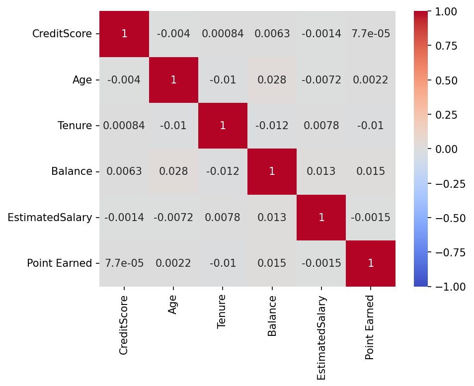
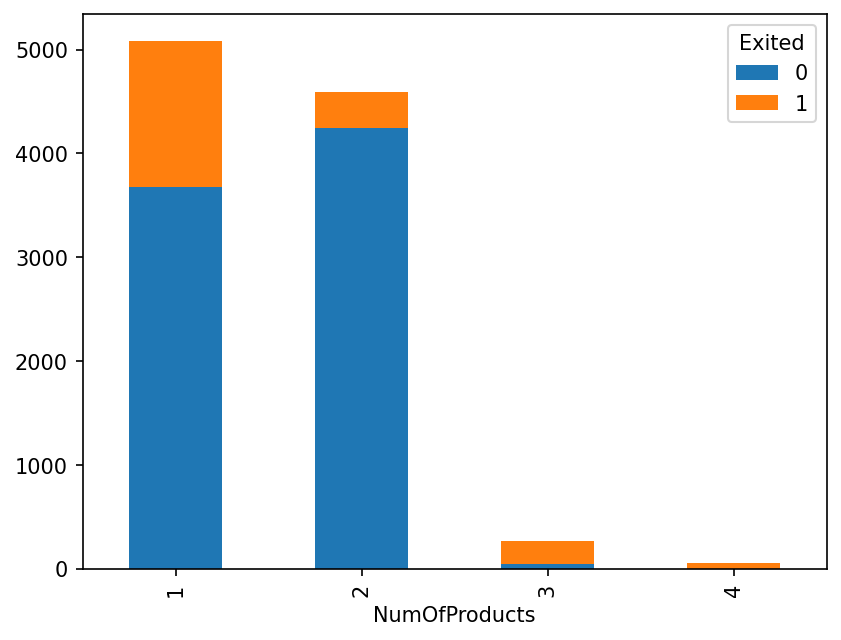
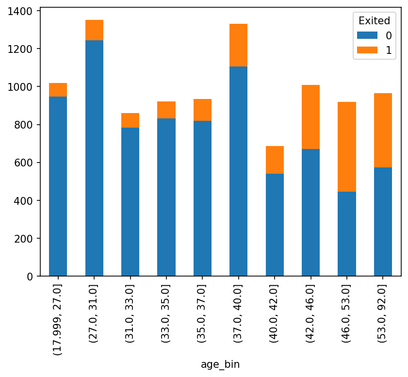
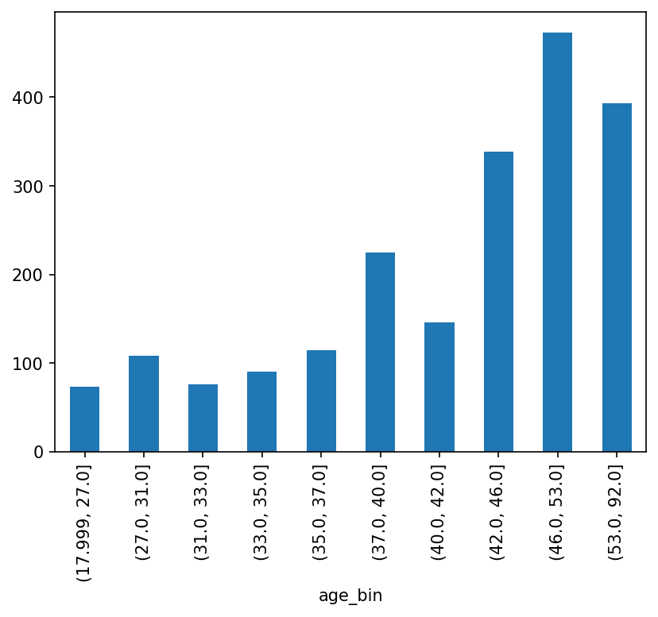
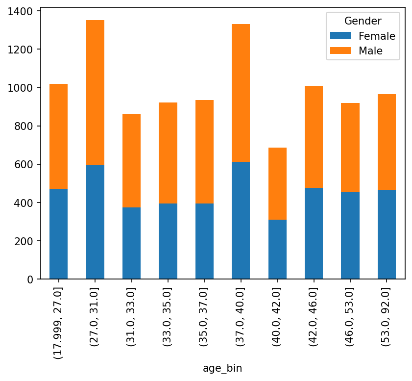
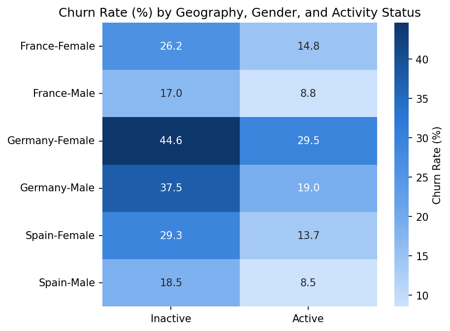
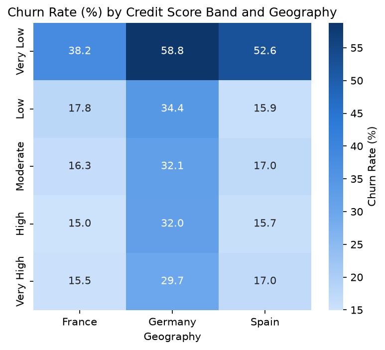
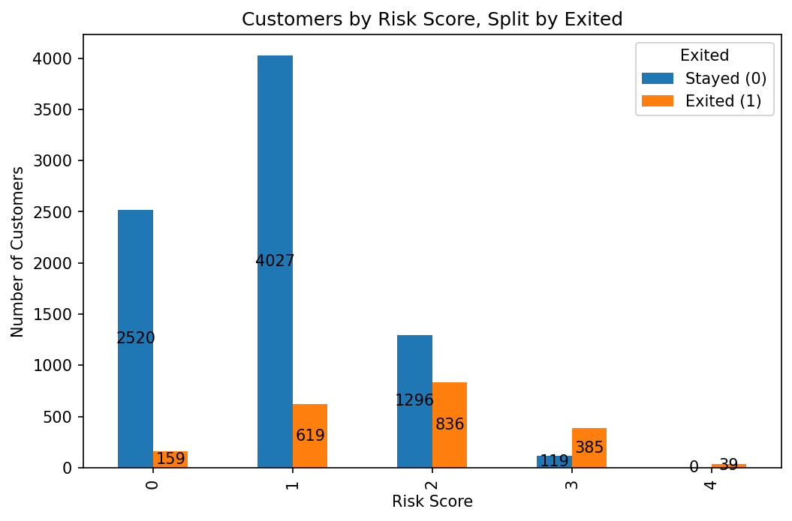

# Bank Churn Analytics Case Study

Exploratory data analysis and driver identification for customer churn at a retail bank using logistic regression, segmentation, and a combined risk score to find out which customers are leaving and why.

## Overview and Business Task

We have a bank customer churn dataset and want to determine which variables actually affect whether a customer leaves the bank, then turn that into an actionable, prioritized list of drivers rather than just a list of correlations. We subsuquently intend to take these list of drivers to propose reasons and recommendations for the bank. The reason Churn Rate matters so much to a bank is because  Acquiring a new customer costs significantly more than retaining an existing one, so identifying what actually drives customers to leave lets the bank direct retention investment (loyalty programs, targeted campaigns) at the customers and behaviors that matter most — rather than spreading effort evenly across the base.

The full technical walkthrough (code, intermediate reasoning, every table) can be referred to in [`EDA.ipynb`](EDA.ipynb). This README summarizes the dataset, method, and findings for anyone who wants the results without reading the notebook.

# Business Questions
1. Which customer attributes are drivers of the bank's churn rate?
2. Do holding a credit card, having a longer tenure, or having a higher balance/salary actually reduce churn risk, as commonly assumed?
3. Does the number of products a customer holds affect their likelihood of leaving?
4. Are older customers more likely to leave, and at what age does risk start rising?
5. Does geography affect churn risk, and is it explained by wealth (balance) or something else?
6. Does active engagement with the bank meaningfully predict retention?
7. Is there a gender gap in churn that survives controlling for age, geography, and activity?
8. Can the independently significant drivers be combined to flag a small, high-priority segment for retention campaigns?

## Dataset
This data is publicly available on [`Kaggle`](https://www.kaggle.com/datasets/radheshyamkollipara/bank-customer-churn).

The dataset ships with its own stated hypotheses about which fields should predict churn (e.g., "higher credit score → less likely to leave," "has a credit card → less likely to leave," "higher balance / higher salary → less likely to leave," "longer tenure → more loyal."). Part of this analysis is testing those assumptions directly against the data rather than taking them at face value and seeing whether these assumptions hold true.

10,000 customer records, one row per customer. Source: [`Customer-Churn-Records.csv`](supplementary/Customer-Churn-Records.csv).

| Field | Description |
|---|---|
| CreditScore | Customer's credit score |
| Geography | Customer's country (France / Germany / Spain) |
| Gender | Customer's gender |
| Age | Customer's age |
| Tenure | Years the customer has been with the bank |
| Balance | Account balance |
| NumOfProducts | Number of bank products the customer holds |
| HasCrCard | Whether the customer holds a credit card |
| IsActiveMember | Whether the customer is an active member |
| EstimatedSalary | Customer's estimated salary |
| Complain | Whether the customer has lodged a complaint |
| Satisfaction Score | Customer's rating of their complaint resolution |
| Card Type | Type of card held |
| Point Earned | Points earned for card usage |
| **Exited** | **Target variable** — whether the customer left the bank |

RowNumber, CustomerId, and Surname are dropped early as they're record identifiers with no predictive value.

## Methodology

1. **Data quality checks** — confirmed no missing values and no duplicate customers.
2. **Univariate analysis & correlations** — histograms, boxplots, and a correlation heatmap across the numeric fields to spot outliers and multicollinearity.
3. **Initial logistic regression** — flagged a *quasi-separation* problem: `Complain` almost perfectly predicts `Exited` (2,034 of 2,044 complainers churned), which was distorting every other coefficient in the model.
4. **Revised logistic regression** — dropped `Complain` (outcome leakage) and re-grouped `NumOfProducts` (4-product customers were a perfect predictor on their own), producing a model that was more accurate.
5. **VIF check** — confirmed no problematic multicollinearity among the remaining predictors.
6. **Segment-level breakdowns** — Geography, IsActiveMember, Credit Score, Card Type, Balance, and Tenure, each cross-checked against the regression results.
7. **Combined Risk Score** — stacked the independently significant drivers into a single 0–4 score per customer to test whether the effects compound.

## Key Findings

### The Data

The data is mostly clean. One interesting observation from univariate analysis: 36% of accounts have a "0" balance, and every one of them belongs to a customer in France or Spain — Germany has zero customers with a $0 balance.

**Data outliers:**
1. CreditScore has a small cluster of low-end outliers below 400, below the Q1–Q3 range of 580–718.
2. Age has many high-end outliers above 62, above the Q1–Q3 range of 32–44.
3. Balance's Q1 sits at 0, consistent with the large mass of zero-balance accounts.

#### Correlation heatmap



There is no serious multicollinearity between the continuous variables — each contributes independent information. The largest correlation is Age and Balance at 0.028, which makes intuitive sense (older customers tend to hold higher balances).

### Regression

Two regressions were run. The initial one triggered a quasi-separation warning and an implausibly inflated odds ratio for `Complain` — almost every customer who complained also left, so `Complain` was standing in for the outcome itself rather than acting as an independent predictor, distorting the standard errors of every other coefficient.

The revised regression (with `Complain` removed) identified six independent drivers of churn all with p < 0.05:

1. NumOfProducts
2. IsActiveMember
3. Geography
4. Age
5. Gender
6. CreditScore

### Churn rate breakdown by factor

Baseline churn rate: **20.38%**. Females (45.4% of customers) churn at 25.07%; males (54.6% of customers) churn at 16.47%.

#### 1. NumOfProducts — strongest driver



| NumOfProducts | Count | Exited Customers | Churn Rate | Male % | Average Age |
|---|---|---|---|---|---|
| 1 | 5,084 | 1,409 | 27.7% | 54.8% | 39.7 |
| 2 | 4,590 | 349 | 7.6% | 55.1% | 37.75 |
| 3 | 266 | 220 | 82.7% | 44.0% | 43.2 |
| 4 | 66 | 60 | 100% | 36.7% | 45.68 |

As customers acquire more products, churn risk rises sharply — 100% of customers with 4 products left the bank. Customers with 3–4 products also skew slightly older and more female.

**Hypotheses:**
- 1-product customers may be in a "trial" phase and leave regardless of experience quality.
- 3–4 product customers likely churn due to a poor experience across multiple products, suggesting broader dissatisfaction with the bank's offerings rather than any single product.

#### 2. Age

Age was split into 10 quantile bins to examine churn concentration. The plot below shows the number of customers by age bin, stacked by whether a customer within an age bin has exited the bank or not.



We can eyeball from the bar chart that older customers are meaningfully more likely to leave the bank.


The plot below zooms into the "Exited" customers by age bin as seen above and shows the total sum of exits split by age bin:



The customer base is evenly distributed by age (28.94% are 42+), but that 28.94% accounts for **59.13%** of all exits — a total of 2,038 exits (20.38% churn rate), of which 1,205 belong to customers aged 42 and above.

I investigated whether the age bins split by gender held any significance:



Gender is evenly split across all age bins, so the age effect isn't confounded by gender composition.


#### 3. Geography — Germany

| Geography | Count | Exited Customers | Churn Rate | Male % | Age |
|---|---|---|---|---|---|
| Germany | 2,509 | 814 | 32.44% | 52.45% | 39.77 |
| France | 5,014 | 811 | 16.17% | 54.90% | 38.51 |
| Spain | 2,477 | 413 | 16.67% | 56.03% | 38.89 |

Germany churns at roughly twice the rate of France and Spain. Germany's average balance is almost double the other two countries', but that's explained entirely by a mix-shift effect (see Balance section in the notebook) — it isn't the mechanism behind the elevated churn.

Splitting by number of products per country:

| NumOfProducts | Geography | Count | Exited Customers | Churn Rate | Male % | Age |
|---|---|---|---|---|---|---|
| 1 | Germany | 1,349 | 578 | 42.85% | 50.77% | 40.57 |
| 1 | France | 2,514 | 564 | 22.43% | 55.61% | 39.18 |
| 1 | Spain | 1,221 | 267 | 21.86% | 57.74% | 39.70 |
| 2 | Germany | 1,040 | 126 | 12.12% | 55.58% | 38.27 |
| 2 | France | 2,367 | 136 | 5.75% | 54.75% | 37.45 |
| 2 | Spain | 1,183 | 87 | 7.35% | 55.45% | 38.89 |
| 3 | Germany | 96 | 86 | 89.58% | 44.79% | 43.66 |
| 3 | France | 104 | 82 | 78.85% | 47.11% | 44.22 |
| 3 | Spain | 66 | 52 | 78.79% | 37.88% | 40.91 |
| 4 | Germany | 24 | 24 | 100% | 41.67% | 44.42 |
| 4 | France | 29 | 29 | 100% | 34.48% | 46.86 |
| 4 | Spain | 7 | 7 | 100% | 28.57% | 45.14 |

At 1–2 products, Germany's ~2x churn premium over France/Spain holds. At 3+ products, geography stops mattering much — churn is dominated by the product count itself, converging toward 100% everywhere.

#### 4. IsActiveMember



**Inactive female customers in Germany have the highest churn rate at 44.6%.**

- Active/inactive membership is split roughly 50/50 across every country and gender.
- Baseline churn is already higher for women (25%) than men (16%).
- Being inactive roughly doubles the churn rate across almost every country/gender combination. The one exception is female German customers, where my inference is that the baseline churn for female German customers is already so high that inactivity adds comparatively little on top.

#### 5. CreditScore

| Credit Score Band | Count | Churn Rate |
|---|---|---|
| Very Low (350–425) | 66 | 48.48% |
| Low (425–550) | 1,524 | 21.6% |
| Moderate (550–675) | 4,279 | 20.43% |
| High (675–800) | 3,476 | 19.41% |
| Very High (800–925) | 655 | 19.54% |



Only the "Very Low" band stands out with a materially higher churn rate — everything from Low to Very High is roughly flat around 19–22%. Splitting by geography, German customers churn at almost double the rate of France/Spain within every credit score band, reaching 62.5% for Germans in the Very Low band. That sample is small (66 customers total), so treat the exact percentage with some caution, but the direction is consistent with every other Germany finding above.

### 6. Combined Risk Score

Four factors came out as independently significant in the revised regression: **Geography = Germany**, **IsActiveMember = inactive**, **Age > 42**, and **NumOfProducts ≥ 3**. Stacking them into a single 0–4 score per customer tests whether these effects compound.



| Risk Score | Count | % of customers | Churn rate |
|---|---|---|---|
| 0 (none present) | 2,679 | 26.8% | 5.9% |
| 1 | 4,646 | 46.5% | 13.3% |
| 2 | 2,132 | 21.3% | 39.2% |
| 3 | 504 | 5.0% | 76.4% |
| 4 (all present) | 39 | 0.4% | 100.0% |

The four factors compound into a clean, near-monotonic staircase. Customers with zero risk factors churn at less than a third of the base rate; customers with 3+ risk factors (543 customers, 5.4% of the base) churn at 78.1% — a segment small enough to act on and large enough to matter.

## Recommendations

- [ ] Tie a business action to each driver above (active-member re-engagement campaigns, a Germany-specific retention investigation, a product-bundling review for 3+ product customers).
- [ ] Surface the Risk Score ≥ 3 segment as a headline "high priority" KPI on any churn dashboard.
- [ ] (Optional) Build a predictive model in a separate notebook if the goal moves beyond driver analysis toward scoring individual customers.

## Power BI Dashboard


The findings above are also packaged as a single-page Power BI dashboard: headline KPIs (total customers, exits, churn rate), the gender split, and churn rate by age band, geography, risk score, activity status (gender and geography), number of products, and credit score band.

**Ways to view it**
- **Video walkthrough** (about 25 seconds): [`PowerBI Bank Churn Analytics Video Showcase.mp4`](supplementary/PowerBI%20Dashboard/PowerBI%20Bank%20Churn%20Analytics%20Video%20Showcase.mp4)
- **PDF snapshot** (static, one page): [`Bank Churn Analytics Dashboard.pdf`](Bank%20Churn%20Analytics%20Dashboard.pdf)
- **Interactive**: download [`Bank Churn Analytics Dashboard.pbix`](supplementary/PowerBI%20Dashboard/Bank%20Churn%20Analytics%20Dashboard.pbix) and open it in Power BI Desktop (free, Windows only).

**Interacting with it**
- The France / Germany / Spain tiles at the top filter every visual by country, and the Customer ID box looks up an individual customer.

## Project Structure

```
Bank Churn Analytics Project/
├── EDA.ipynb                                                # Full analysis notebook: data load, EDA, regression, segmentation
├── README.md                                                # This file
├── Bank Churn Analytics Dashboard.pdf                       # Static one-page PDF export of the dashboard
└── supplementary/                                           # Source data, exported charts, Power BI dashboard files, and regression output
    ├── Customer-Churn-Records.csv                           # Source dataset
    ├── figures/                                             # Chart images exported from the notebook via plt.savefig()
    ├── PowerBI Dashboard/                                   # Power BI dashboard and video walkthrough
    │   ├── Bank Churn Analytics Dashboard.pbix              # Interactive dashboard (open in Power BI Desktop)
    │   └── PowerBI Bank Churn Analytics Video Showcase.mp4  # Short video walkthrough of the dashboard
    ├── PowerBI Dashboard Images/                            # Dashboard screenshots shown in this README
    ├── Initial Regression.txt                               # Saved statsmodels output from the initial regression
    ├── .env.example                                         # Template for local MySQL credentials
    └── .env                                                 # Local MySQL credentials (gitignored, never committed)
```

## Setup & Usage

1. Clone the repo.
2. Choose a data source:
   - **MySQL** (default/active path): copy `supplementary/.env.example` to `supplementary/.env` and fill in your local MySQL credentials, then load the `customer churn records` table with the contents of `supplementary/Customer-Churn-Records.csv`.
   - **CSV** (no database needed): in the notebook, comment out the SQL cells near the top and uncomment `df = pd.read_csv("supplementary/Customer-Churn-Records.csv")` instead.
3. Install dependencies:
   ```bash
   pip install pandas numpy matplotlib seaborn statsmodels mysql-connector-python python-dotenv jupyter
   ```
4. Open `EDA.ipynb` and run all cells top to bottom. Chart images will regenerate into `supplementary/figures/` automatically.

## Tech Stack

Python · pandas · numpy · matplotlib · seaborn · statsmodels · MySQL · Power BI
